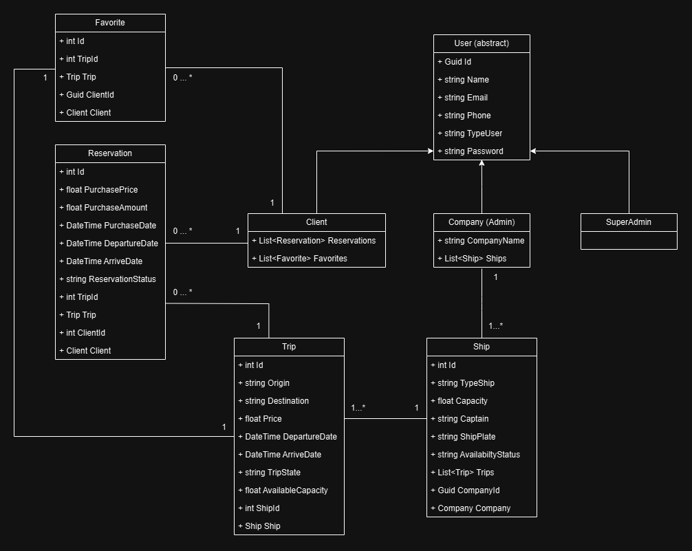

# Minuta de Relevamiento del Sistema de Gestion de Transporte de Granos : |AgriCargo|

- **GitHub**: [Repositorio AgriCargo API](https://github.com/MarucoMass/Agricargo-API)
- **Participantes**: Massonnat Mario y Francisco Palena

## 1. Contexto del Proyecto

AgriCargo es una aplicacion especializada en la gestion del transporte de granos exclusivamente por via maritima. Su objetivo es conectar a los productores y exportadores de granos con empresas de transporte maritimo que ofrecen sus servicios, facilitando el proceso de busqueda, reserva y gestion de viajes a traves de una interfaz intuitiva y robusta.

El sistema este diseñado para gestionar el transporte de granos, facilitando la interaccion entre los clientes, las empresas de transporte y los administradores. Las principales entidades que participan en el sistema son los Usuarios (Clientes, Empresas, SuperAdministradores), los Viajes y los Transportes (Barcos), Favoritos y Reservas.

La aplicacion utiliza un sistema de autenticacion para asegurar que solo usuarios registrados puedan realizar reservas o gestionar barcos.

### Funcionalidades Principales

- **Busqueda de Viajes**: Los usuarios pueden buscar viajes disponibles en funcion de sus necesidades sin necesidad de tener previamente una cuenta. La busqueda puede realizarse por origen, destino y cantidad a transportar en toneladas.

- **Reserva de Viajes**: Los clientes registrados pueden realizar la reserva de un viaje, visualizar el precio por tonelada de grano y calcular el costo total segun la carga que deseen enviar.

- **Favoritos**: La plataforma permite que los clientes guarden ciertos viajes como "favoritos" para consultarlos mas tarde.

- **Perfil de Usuario y Gestion de Reservas**: Cada cliente puede visualizar y gestionar sus reservas, cancelar reservas antes de la partida y revisar detalles del viaje.

- **Empresas de Transporte Maritimo (Companies)**: Las empresas pueden registrarse, cargar sus barcos y gestionar sus viajes en la aplicacion.

- **Gestion de Barcos y Viajes**: Las empresas pueden registrar y gestionar barcos con informacion relevante, como capacidad y disponibilidad para transportar granos.

- **Sistema de Administracion Avanzado (SuperAdmin)**: El SuperAdmin tiene control sobre todos los usuarios, barcos y viajes, supervisando la plataforma y resolviendo disputas o problemas tecnicos.

## 2. Entidades Principales

### 2.1 User (abstracto)
Atributos generales para todos los usuarios:
- **Atributos**: Id, Name, Email, Phone, TypeUser, Password
- **Tipos de usuarios**: Client, Company (admin), SuperAdmin

### 2.2 Client (Usuario Cliente)
Representa al cliente que realiza reservas de transporte.
- **Relaciones**:
  - Lista de reservas: `List<Reservation>`
  - Lista de favoritos: `List<Favorite>`

### 2.3 Company (Usuario Empresa/Admin)
Representa a la empresa que ofrece servicios de transporte maritimo.
- **Atributos**:
  - CompanyName
  - Lista de barcos: `List<Ship>`

### 2.4 SuperAdmin
Usuario con permisos avanzados para gestionar toda la plataforma.

## 3. Entidades Operacionales

### 3.1 Favorite (Favoritos)
Permite a los clientes marcar viajes como favoritos.
- **Atributos**: Id, TripId, ClientId
- **Relaci�n**: Relacionado con un cliente y un viaje especifico

### 3.2 Reservation (Reservacion)
Maneja las reservas realizadas por los clientes.
- **Atributos**: Id, ClientId, Client, TripId, Trip, PurchasePrice, PurchaseAmount, ReservationStatus, purchaseDate, DepartureDate, ArriveDate
- **Relacion**: Relacionada con un cliente y un viaje

### 3.3 Trip (Viaje)
Representa los viajes que ofrecen las empresas.
- **Atributos**: Id, Origin, Destination, Price, DepartureDate, ArriveDate, TripState, AvailableCapacity, ShipId, Ship
- **Relacion**: Relacionado con un barco especifico y puede tener multiples reservas

### 3.4 Ship (Barco)
Entidad que representa los barcos disponibles para el transporte.
- **Atributos**: Id, TypeShip, Capacity, Captain, ShipPlate, AvailabilityStatus, Trips, CompanyId, Company
- **Relacion**: Cada barco puede tener multiples viajes asociados y esta relacionado con una empresa

## 4. Relaciones Importantes

- Un **Client** puede tener multiples **Reservations** y **Favorites**.
- Una **Company** puede tener multiples **Ships**.
- Un **Ship** puede tener multiples **Trips**.
- Un **Trip** puede ser favorito de m�ltiples **Clients** y tener m�ltiples **Reservations**.

